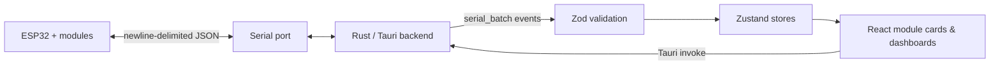

<div align="center">

# Pinora

### A desktop control surface for modular ESP32 projects

Connect. Discover. Monitor. Control.

[](./package.json)
[](#project-status)
[](https://tauri.app/)
[](https://react.dev/)
[](https://www.espressif.com/en/products/socs/esp32)

> [!WARNING]
> **Pinora v0.1.0 is a pre-alpha prototype.** It is under active development, APIs and message formats may change without notice, and it is not ready for production or safety-critical hardware.

</div>

---

## What is Pinora?

Pinora is an experimental desktop application for interacting with an ESP32 and its attached hardware modules over a serial connection.

The ESP32 announces its modules at runtime. Pinora turns those registrations into live controls, listens for device events, keeps the interface in sync, and sends commands back as newline-delimited JSON. The goal is a reusable control surface where adding a sensor or actuator does not require rebuilding the entire desktop application.

This repository currently contains the **Tauri desktop application** and its shared serial protocol definitions. The matching ESP32 firmware source is not included here; a device must implement the protocol described below to communicate with the app.

## Current capabilities

- Discover available serial ports and connect at a configurable baud rate
- Register modules dynamically as the ESP32 announces them
- Validate incoming messages before they enter application state
- Batch high-frequency serial messages in the Rust backend
- Display live module state and send hardware commands
- Visualize LiDAR distance data on an interactive 181 × 181 canvas
- Select a LiDAR region of interest and move the scan target
- Inspect a rolling activity log of registrations and module events
- Run as a native desktop application through Tauri

### Module support

| Module | Registration | Live events | Desktop controls | Notes |
| :--- | :---: | :---: | :---: | :--- |
| LED | ✅ | ✅ | ✅ | Brightness/state and toggle commands |
| Servo | ✅ | ✅ | ✅ | Angle control; also used as LiDAR axes |
| Button | ✅ | ✅ | Read-only | Displays press/release state |
| Rangefinder | ✅ | ✅ | ✅ | Ranging, timing budget, and distance mode |
| LiDAR | ✅ | ✅ | ✅ | Scan control, ROI selection, target movement, and heatmap |
| System log | Protocol only | ✅ | Activity log | Recorded but not represented as a device card |
| LED cluster | Partial | — | — | Command schema exists; state and event handling do not |
| IMU | Identifier only | — | — | Planned |

## How it works



The application has four main layers:

1. **ESP32 protocol** — the device sends registrations and module events, and receives commands.
2. **Rust serial runtime** — Tauri opens the port, reads on a worker thread, parses JSON, batches messages, and writes commands.
3. **Typed state layer** — Zod validates wire data while Zustand tracks the connection, modules, lookup IDs, and activity.
4. **React interface** — pages render device cards, connection settings, logs, and the dedicated LiDAR dashboard.

Incoming messages are flushed to the frontend after **250 messages** or approximately **33 ms**, whichever comes first. This keeps frequent sensor updates from generating a separate frontend event for every serial line.

## Serial protocol at a glance

Every message is a single JSON object followed by a newline (`\n`). The default connection speed is **115200 baud**.

### 1. Register a module

The firmware announces each available module:

```json
{
  "type": "Registration",
  "payload": {
    "id": "led-01",
    "module_type": "Led",
    "lool_up_id": "status_led",
    "parent_id": ""
  }
}
```

> [!NOTE]
> `lool_up_id` is the current wire-format field name. The spelling is retained for compatibility during pre-alpha development and may be corrected in a future protocol revision.

### 2. Send a module event

The device reports a state change:

```json
{
  "type": "ModuleEvent",
  "payload": {
    "module_type": "Led",
    "event": {
      "event_type": "Brightness",
      "id": "led-01",
      "level": 80
    }
  }
}
```

### 3. Receive a command

Pinora writes a command back to the device:

```json
{
  "id": "led-01",
  "module_type": "Led",
  "payload": {
    "command": "SetState",
    "state": 80
  }
}
```

The TypeScript definitions in [`src/lib`](./src/lib) validate frontend data, while the matching Rust structures live in [`src-tauri/src/protocol`](./src-tauri/src/protocol).

## Technology

| Layer | Tools |
| :--- | :--- |
| Desktop shell | Tauri 2 |
| Backend | Rust, `serialport`, Serde |
| Frontend | React 19, TypeScript, Vite |
| State and validation | Zustand, Zod |
| Interface | Tailwind CSS 4, shadcn/ui, Radix UI |
| Visualization | Canvas API |
| Package manager | Bun |

## Project structure

```text
tauri_esp_app/
├── src/                         # React + TypeScript frontend
│   ├── components/
│   │   ├── Modules/             # Module-specific cards and controls
│   │   ├── ui/                  # Reusable shadcn/Radix UI primitives
│   │   ├── Grid.tsx             # LiDAR heatmap and ROI interaction
│   │   └── LogFrame.tsx         # Virtualized device activity log
│   ├── lib/
│   │   ├── Modules/             # Module schemas, initial state, reducers
│   │   ├── ListenStore.ts       # Serial connection and event listener state
│   │   ├── ModuleStore.ts       # Runtime module registry and command bridge
│   │   ├── ModuleCommand.ts     # Outgoing command schemas
│   │   └── ModuleEven.ts        # Incoming event schemas
│   ├── page/                    # Home, dashboard, devices, ports, and logs
│   ├── Layout.tsx               # Application shell and navigation
│   └── main.tsx                 # Router and application entry point
├── src-tauri/                   # Native Rust backend
│   ├── src/
│   │   ├── protocol/            # Rust command, event, and registration types
│   │   ├── shared_types/        # Serial runtime state
│   │   ├── global_definition.rs # Batch and timing configuration
│   │   └── lib.rs               # Tauri commands and serial worker
│   ├── capabilities/            # Tauri permission declarations
│   ├── icons/                   # Desktop bundle icons
│   ├── Cargo.toml               # Rust dependencies
│   └── tauri.conf.json          # Window, build, and bundle configuration
├── package.json                 # Frontend dependencies and scripts
├── vite.config.ts               # Vite, Tailwind, and Tauri dev configuration
└── bun.lock                     # Locked JavaScript dependencies
```

## Getting started

### Prerequisites

Install:

- [Bun](https://bun.sh/)
- [Rust](https://www.rust-lang.org/tools/install)
- The [Tauri 2 system prerequisites](https://v2.tauri.app/start/prerequisites/) for your operating system
- A USB serial driver for your ESP32 board, if required by the board

You will also need an ESP32 device that emits protocol-compatible newline-delimited JSON.

### Install and run

```bash
git clone <your-repository-url>
cd tauri_esp_app
bun install
bun run tauri dev
```

In the application:

1. Open **Port Settings**.
2. Select the ESP32 serial port.
3. Confirm the baud rate; the default is `115200`.
4. Connect and wait for module registrations.
5. Use **Devices**, **Dashboard**, and **Logs** to interact with the hardware.

To run only the browser frontend:

```bash
bun run dev
```

Serial features require the Tauri runtime and will not work in an ordinary browser tab.

### Build a desktop bundle

```bash
bun run tauri build
```

Tauri writes the platform-specific installers and bundles beneath `src-tauri/target/release/bundle/`.

## Project status

**Version:** `0.1.0`<br>
**Maturity:** **Pre-alpha / experimental**

The foundations are in place, but the project is still being shaped. Expect incomplete screens, rough edges, protocol changes, and limited hardware coverage.

Known pre-alpha limitations:

- There is no automated test suite yet.
- Serial reconnect and device hot-plug behavior are still basic.
- The protocol is not versioned and is likely to evolve.
- Module definitions are duplicated between Rust and TypeScript.
- Some identifiers and event names retain early prototype spelling.
- IMU and LED-cluster support is incomplete.
- The home screen still contains development/demo controls.
- Packaging and behavior have not been validated across every desktop platform.

## Roadmap

- [ ] Version the serial protocol
- [ ] Add shared protocol fixtures and automated tests
- [ ] Improve reconnect, disconnect, and hot-plug handling
- [ ] Finish LED-cluster and IMU modules
- [ ] Add module capability discovery
- [ ] Replace remaining prototype screens and naming
- [ ] Add firmware examples and an integration guide
- [ ] Validate installers on macOS, Windows, and Linux

## Contributing

This project is early enough that thoughtful experiments are welcome. Before making a large change, open an issue or discussion describing the hardware, module, or protocol behavior you want to add.

When contributing:

1. Keep Rust and TypeScript protocol definitions aligned.
2. Validate all incoming serial data.
3. Preserve the one-JSON-object-per-line wire format.
4. Test changes against real hardware when possible.
5. Clearly mark features that are simulated or not hardware-tested.

---

<div align="center">

Built for curious hardware experiments—one module at a time.

**Pinora v0.1.0 · Pre-alpha**

</div>
